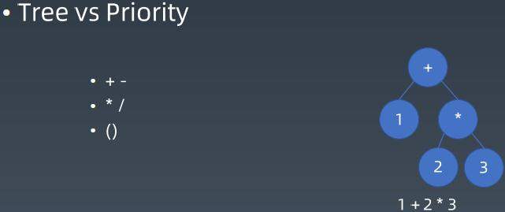
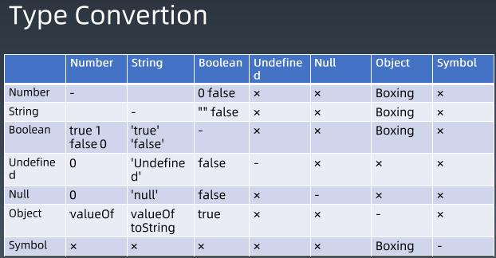
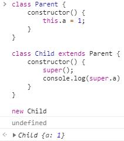

# 前端进阶训练营第三周总结

## 第二周知识点补充

js中的数字，是双精度浮点型数字。

#### 判断正负0

+0 -0 IE754中是一样的，用1除来区分

```
function check(zero) {
    if (1 / zero === Infinity) {
        +0
    }
    if (1 / zero === -Infinity) {
        -0
    }
}
```

#### 精度流失

```
(1.3 + 1.1 - 2.4) < Number.EPSILON //false
```

三次十进制转换二进制，最坏5个E的差值，不同的浮点数运算，精度丢失的程度不一样

## 重学 JavaScript | 表达式，类型转换

### Atom

### 表达式

#### 语法

运算符优先级：https://developer.mozilla.org/zh-CN/docs/Web/JavaScript/Reference/Operators/Operator_Precedence

概念：优先级其实是用表达式生成树实现



例：`1+2*3`实质上是将加号右边`2*3`的部分变成一个新的节点，然后建立*节点

使用者角度：运算符的优先级

语言的定义和实现角度：树的结构生成的语法

用树去理解js表达式

#### 运行时

Type Convertion



## Expression

Member 成员(属性)访问/Left hand side

- a.b 属性访问

- a[b] 属性访问，一般是字符串，可以使用变量，运行时动态赋值
- foo``string``
  - 优先级和前两项相同，与member无关
  - 没有运算符，字符串模板津贴自定义内容

```javascript
var name = "yi"
`hi,${name}`
//"hi,yi"
function foo() {
  console.log(arguments)
}
foo`Hello ${name}`;
```

- super.b
  调用父类的属性或方法



- super['b']
- new.target 
  只能在函数里面用，判断是否为new调用，判断哪个New调用

```
function foo() {
  console.log(new.target);
}
new foo()
```

- new Foo()

new/Left hand side

- new Foo

```
function cls1(s) { console.log(s)}
function cls2(s) {
  console.log("2", s);
  return cls1;
}
new new cls2("good")
new (new cls2("good"))
```


Reference

- - 属性

- - - Object
    - key

- - 运算符

- - - delete
    - asign

call/Left hand side

- foo()
- super()
- foo()['b']
- foo().b
- foo()`abc`

```
class foo {
    constructor() {
        this.b = 1
    }
}
new foo()["b"]
```

Left Handside & Right Handside

```
a.b = c
a + b = c
```

Update /Right hand side

```
//a 和 ++ -- 之间不可以有回车等
a ++ 
a --
//++ -- 和 a 之间可以有回车
-- a 
++ a
```

Unary 单目运算符

- delete a.b
  - void foo() 生成 undefined
  - typeof a

```
typeof null //"Object"
typeof function(){} //"function"
```

- \+ a
- \- a
- ~ a
- ! a

```
!!1 //true
```

- await a

Exponental

- ** 右结合

```
2**2**3 
2**(2**3)
```

Multiplicative

- \* / %

Additive

- +-

Shift

Relationshop

Equality

- ==
- !=
- ===
- !==

Bitwise

- $^|

Logical

- ||
- &&

```
function foo1() {
  console.log(1)
  return false
}
function foo2() {
  console.log(2)
}
foo1() && foo2() //foo2() 不执行
foo1() || foo2()
```

Conditional

- ? :


#### 装箱转换

```
//对象
new String("1")
new Number(1)
new Boolean(true) 
Object("1")
Object(Symbol("1"))
(function(){return this}).apply(Symbol("a"))

//类型
String("1") //"1"
Number(1)
Boolean(true)
```


#### 拆箱转换

```
1 + {}
1 + {valueOf() {return 2}}
1 + {toString() {return 2}}
1 + {valueOf() {return 1}}
1 + {[Symbol.toPrimitive](){return 6}, valueOf(){return 2}, toString(){return 3}}
1 + {valueOf(){return {}}, toString() {return 3}}
```

## 重学 JavaScript | 语句，对象

### Completion Record

• [[type]]: normal, break, continue, return, or throw
• [[value]]: Types
• [[target]]: label


### 简单语句

• ExpressionStatement
• EmptyStatement
• DebuggerStatement
• ThrowStatement
• ContinueStatement
• BreakStatement
• ReturnStatement


### 复合语句

• BlockStatement
• IfStatement
• SwitchStatement
• IterationStatement
• WithStatement
• LabelledStatement
• TryStatement


### block

• BlockStatement{
   ░░░░
   ░░░░
   ░░░░
}

• [[type]]: normal
• [[value]]: --
• [[target]]: --


### Iteration

• while( ▒▒ ) ░░░░
• do ░░░░ while( ▒▒ );
• for( ▓▓ ; ▒▒ ; ▒▒) ░░░░
• for( ▓▓ in ▒▒ ) ░░░░
• for( ▓▓ of ▒▒ ) ░░░░
• for await( of )
• var
• const / let
• in


### 标签、 循环 break、 continue

• LabelledStatement
• IterationStatement
• ContinueStatement
• BreakStatement
• SwitchStatement
• [[type]]: break continue
• [[value]]: --
• [[target]]: label


### try

try {
░░░░░░░░
} catch( ▓▓▓ ) {
░░░░░░░░
} finally {
░░░░░░░░
}
• [[type]]: return
• [[value]]: --
• [[target]]: label


### 声明

• FunctionDeclaration
• GeneratorDeclaration
• AsyncFunctionDeclaration
• AsyncGeneratorDeclaration
• VariableStatement
• ClassDeclaration
• LexicalDeclaration


• function
• function *
• async function
• async function
• var
• class
• const
• let


### 预处理（pre-process）

```javascript
var a = 2;
void
function () {
    a = 1;
    return;
    var a;
}();
console.log(a);
var a = 2;
void
function () {
    a = 1;
    return;
    const a;
}();
console.log(a);
```


### 作用域

```javascript
var a = 2;
void
function () {
    a = 1; {
        var a;
    }
}();
console.log(a);
var a = 2;
void
function () {
    a = 1; {
        const a;
    }
}();
console.log(a);
```

- 按照 ECMAScript 标准，一些特定语句（statement) 必须以分号结尾。分号代表这段语句的终止。但是有时候为了方便，这些分号是有可以省略的。这种情况下解释器会自己判断语句该在哪里终止。这种行为被叫做 “自动插入分号”，简称 ASI (Automatic Semicolon Insertion) 。实际上分号并没有真的被插入，这只是个便于解释的形象说法。
- var 最好写在函数内最前面或变量第一次出现的地方,var无论出现在当前作用域的那一部分都会预解析（变量提升）到当前作用于顶部，let/const因为会产生暂时性死区而不会出现问题。

ClassDeclartion

类声明只能声明一次，必须先声明后使用，let 和 const 一样，不能做提升，


## Object

中文意义：**对象**，英文意指**世间万物**

**对象三要素：唯一性，状态、行为**


#### 归类思想

多继承


#### 分类思想

单继承结构，会有一个基类


## 根据课上老师的示范，找出 JavaScript 标准里所有的对象，分析有哪些对象是我们无法实现出来的，这些对象都有哪些特性？写一篇文章，放在学习总结里。

- Array：Array 的 length 属性根据最大的下标自动发生变化。
- Object.prototype：所有正常对象的默认原型，不能再给它设置原型了。
- String：为了支持下标运算，String 的正整数属性访问会去字符串里查找。
- Arguments：arguments 的非负整数型下标属性跟对应的变量联动。
- 模块的 namespace 对象：特殊的地方非常多，跟一般对象完全不一样，尽量只用于 import 吧。
- 类型数组和数组缓冲区：跟内存块相关联，下标运算比较特殊。
- bind 后的 function：跟原来的函数相关联。