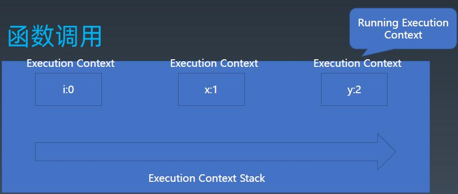
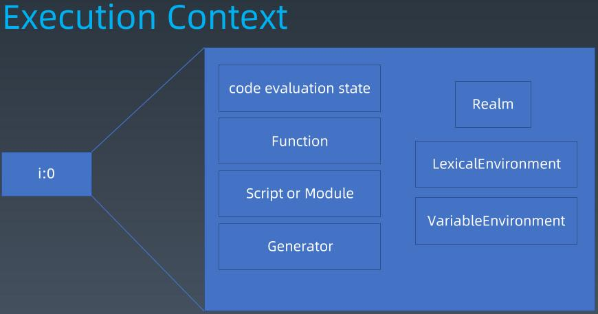
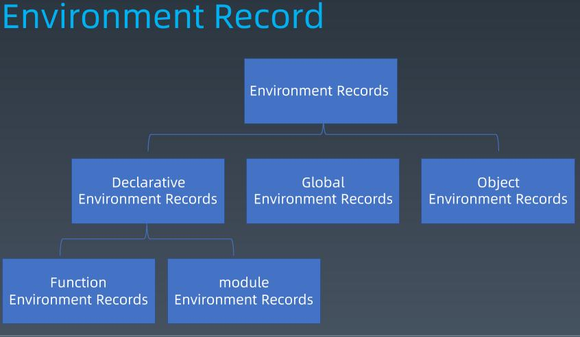
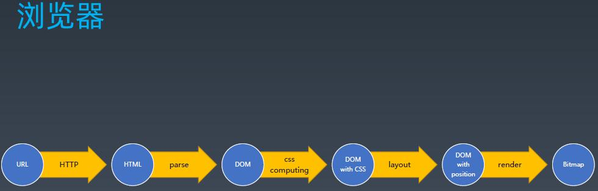
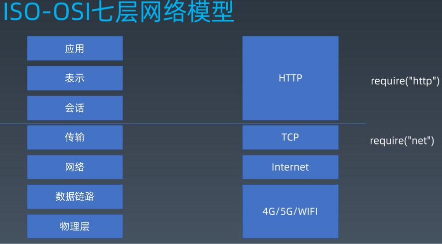
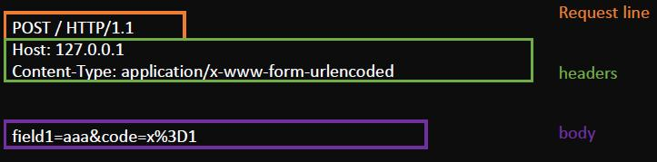
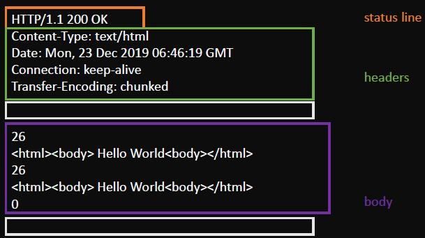

# 第五周总结

## 重学 JavaScript | 结构化（二）

### JS执行粒度：

+ JS Context => Realm
+ 宏任务
+ 微任务(Promise)
+ 函数调用(Execution Context)
+ 语句/声明
+ 表达式
+ 直接量/变量/this……

### Realms

Realm包括一套内置对象，一个ECMAScript全局环境，所有加载到全局环境中的ECMAScript代码以及关联状态和资源。

每运行一个js context都会产生一个Realm，不同的Realm里提供的资源可能一致，但互相之间是不相等也不影响的状态。

### 函数调用



#### Excution Context Stack

**执行上下文栈:Excution Context Stack**

函数进入和退出的点

**每个栈中会存在多个 执行上下文(Excution Context) ,**当函数调用，进入一个函数时，会执行一次 **Excution Context Stack的push操作，当函数返回时，则会发生一次 pop操作**

**Excution Context Stack** 栈顶的元素 有一个特殊的名字: **Running Excution Context**

**Running Excution Context**是执行栈中的栈顶元素，表示当前执行的代码。

当栈顶元素执行完成之后，将栈顶元素弹出，栈顶指针指向下一个 EC。

#### Execution Context

Execution Context包括

+ code evaluation state

  + 用于恢复代码执行位置。一般来说，执行async函数和generator函数的时候需保存

+ Function

  + 如果当前EC执行的代码是函数对象，值为这个函数对象；如果执行的是脚本或模块中的代码，值为null

+ Realm

  + 当前EC执行所需的全局资源

  在js中，函数表达式和对象直接量均会创建对象

  使用 `.` 做隐式转换也会创建对象

  这些对象也是有原型的，如果没有realm，就不知道他们的原型是什么

  ```
  // 需要realm, 因为他是有protype的
  var x={};
  
  
  // true
  Object.getPrototypeOf({}) === Object.prototype
  ```

+ Script or Module

  + 执行的任务是脚本或者模块时使用，表示正在被执行的代码

+ Generator

  + 仅生成器上下文有这个属性，表示当前生成器

+ Lexical Environment(词法环境)

  获取下列值时使用

  + this
  + new.target
  + super
  + 变量

+ Variable Environment

  + 处理var声明

#### Environment Record



函数调用，会带上自己的环境记录。闭包机制

## 浏览器工作原理 | HTTP协议+语法与词法分析（一）



### **浏览器地址输入URl到最后看到网页中间发生了什么**

1. 拿到url,经过http请求,返回html
2. 对html进行解析，生成dom树(此时dom树上没有css信息)
3. 解析css(css computing)，形成带css的dom树
4. 对界面进行layout(排版)，形成带位置的dom树
5. 进行render(渲染)，形成Bitmap(内存中的一张图片)，然后将图片显示到频幕上

### ISO七层网络模型



现代网络中基本是应用、表示、会话混用的情况，http相当于三层的协议

浏览器部分对应tcp的上层

node.js中tcp层对应的包是net，http层对应的包是http

tls/ssl协议也在传输层

### TCP IP的一些基础知识

**TCP:**（全双工通道，服务端）

- 流(可靠的流式传输，收不到会重新发送)
- 端口（tcp协议的标识）
- require('net'), node中访问TCP的库

**IP:**

- 包
- IP地址（ip协议的标识）
- libnet/libcap  , c++，c#等语言访问Ip常用的库

抓包工具：wireshark(网卡所有协议都会抓到)、fiddler(ip层)、charles

### HTTP

在tcp基础上规定的request-response模型：一问一答，先问后答。

服务端无法主动发送消息

- request
- response

## 浏览器工作原理 | HTTP协议+语法与词法分析（二）

## HTTP 组成解析

### Request



### Reponse



### 状态机

状态模式：允许一个对象在其内部状态改变的时候改变它的行为，对象看起来似乎修改了它的类。状态模式就是一种适合多种状态场景下的设计模式