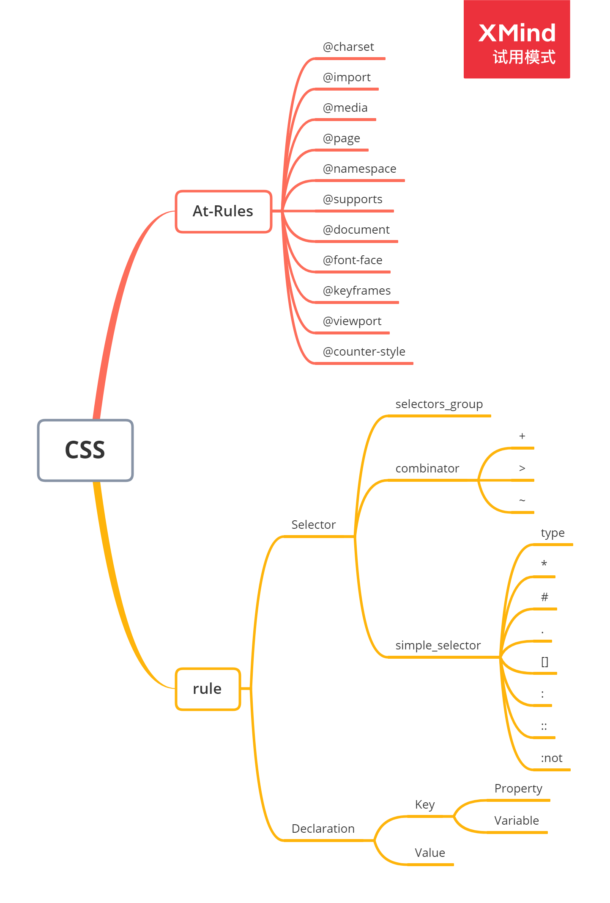

# 前端进阶训练营第七周总结

## 浏览器工作原理 | CSS计算，排版,渲染，合成（二）

### 排版技术

#### 第一代：正常流（normal flow）

display/position/float

#### 第二代：flex

#### 第三代：grid

### flex：

主轴的排布方向（flex-direction）：

1. 从左往右排 (row)
2. 从右往左排 (row-reverse)
3. 从上往下排 (column)
4. 从下往上排 (column-reverse)

**主轴代表元素的排布方向，交叉轴代表跟主轴垂直的方向，元素根据先后顺序（order）排布**


**主轴为左右排布（row/row-reverse）**

Main(主轴对应属性): width, x, left, right

Cross(交叉对应属性): height, y, top, bottom

**主轴为上下排布（column、column-reverse）**

Main(主轴对应属性):  height, y, top, bottom

Cross(交叉对应属性): width, x, left, right

### 一. 收集元素进行(hang)


### 二. 计算主轴

**如果flex布局的某一子元素拥有 flex属性， 则此元素的尺寸会自动填满 剩余空间，**

**当计算主轴的时候， 会先计算 非 flex子元素的尺寸，排布完毕后。计算剩余空间是所少，最后把剩余空间赋值给 拥有 flex属性的子元素**

**如果多个子元素有拥有flex属性，会按照flex属性的比例来分配剩余空间**


计算主轴方向

- 找出所有flex元素
- 把主轴方向的剩余尺寸按比例分配给这些元素
- 若剩余空间为负数，所有flex元素为0(不缩放)，等比压缩剩余元素

### 三. 计算交叉轴


计算交叉轴方向

- 根据每一行中最大元素尺寸计算行高
- 根据行高 flex-align和 item-align  确定元素具体位置

### 四. 绘制

#### 第一步-绘制单个元素

- 利用npm包images搭建一个绘制图形环境
- 绘制在viewPort上进行
- 与绘制相关的属性：background-color，background-image、border等。

#### 第二步-绘制DOM

- 递归调用子元素的方法完成DOM树的绘制
- 忽略一些不必要绘制的节点
- 忽略字体绘制
- 忽略图层compositing

## 重学CSS | CSS基本语法,CSS基础机制（一）

### CSS语法的研究

CSS总体结构

- @charset
- @import
- rules
  - @media
  - @page
  - rule

### CSS@规则的研究

At-rules:

- @charset: https://www.w3.org/TR/css-syntax-3/
- @import: https://www.w3.org/TR/css-cascade-4/
- @media:https://www.w3.org/TR/css3-conditional/
  - 可以互相嵌套
- @page: https://www.w3.org/TR/css-page-3/
- @namespace: https://www.w3.org/TR/css-namespaces-3/
- @supports: https://www.w3.org/TR/css3-conditional/
- @font-face: https://www.w3.org/TR/css-fonts-3/
- @keyframes: https://www.w3.org/TR/css-animations-1/
- @counter-style: https://www.w3.org/TR/css-counter-styles-3/

### CSS规则的结果

CSS规则

- Selector
  - https://www.w3.org/TR/selectors-3/
  - https://www.w3.org/TR/selectors-4/
- Key
  - Properties
  - Variables:https://www.w3.org/TR/css-variables/
    - 双-开头
    - 使用时用var函数
- Value
  - https://www.w3.org/TR/css-values-4/

### 初建CSS知识体系



### 实验 收集标准（爬虫）

 https://www.w3.org/TR/?tag=css 页面本身就使用js过滤,会渲染出所有标准,直接在控制台执行对标签属性的过滤就可以拿到标准的集合。

```javascript
var lis = document.getElementById("container").children

var result = [];

for(let li of lis) {
    if(li.getAttribute('data-tag').match(/css/))
        result.push({
            name:li.children[1].innerText,
            url:li.children[1].children[0].href
        })
}

console.log(result)

```

执行上述代码收集到的标准请查阅同级文件目录下的

[css-standards.js]: ./css-standards.js	"css-standards.js"

文件。

### 实验 收集CSS属性相关标准（爬虫）

property及其语法散布在各个标准中，标准中会有产生式的标注类prod;

```javascript
let iframe = document.createElement("iframe");
document.body.innerHTML = "";
document.body.appendChild(iframe);

function happen(element, event){
    return new Promise(function(resolve){
        let handler = () => {
            resolve();
            element.removeEventListener(event, handler);
        }
        element.addEventListener(event, handler);
    })
}

void async function(){
    for(let standard of standards) {
        //此处使用的数据源为css-standars.js的数据
        iframe.src = standard.url;
        console.log(standard.name);
        await happen(iframe, "load");
    }
}();

```

